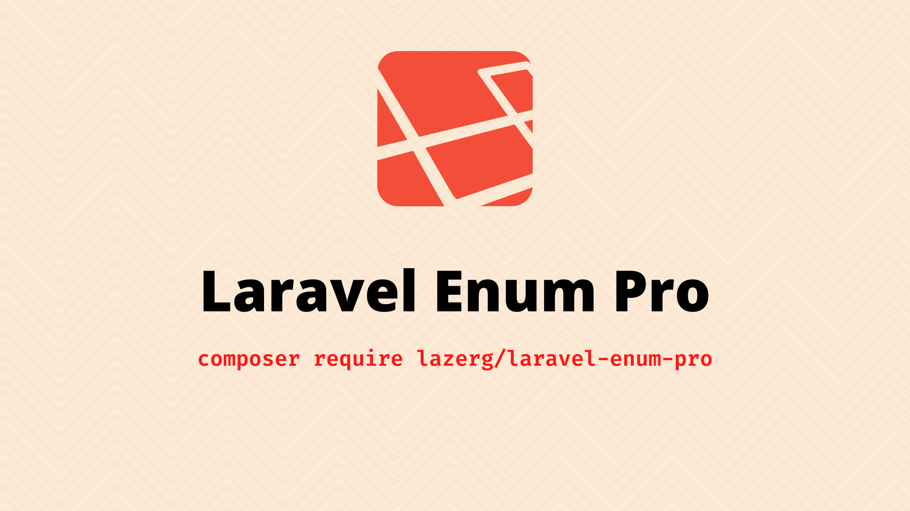

# Laravel Enum Pro



[](https://packagist.org/packages/lazerg/laravel-enum-pro)
[](https://packagist.org/packages/lazerg/laravel-enum-pro)
[](https://github.com/lazerg/laravel-enum-pro)
[](https://github.com/lazerg/laravel-enum-pro)
[](https://packagist.org/packages/lazerg/laravel-enum-pro)

`Laravel Enum Pro` is a simple trait that extends PHP 8.1+ enums with helpful utilities for Laravel applications. It lets you access enum data in a variety of convenient ways while keeping your code clean and expressive.

## Features

- Works directly with native PHP enums
- Access case values via static method calls
- Retrieve enum names and values as collections, arrays or strings
- Generate random values for testing and factories
- Build option and selection lists for form inputs

## Installation

```bash
composer require lazerg/laravel-enum-pro
```

## Basic Usage

Create an enum and include the trait:

```php
enum LevelTypes: int
{
    use \Lazerg\LaravelEnumPro\EnumPro;

    case VERY_EASY = 1;
    case EASY = 2;
    case MEDIUM = 3;
    case STRONG = 4;
    case VERY_STRONG = 5;
}
```

### Accessing Values

```php
LevelTypes::VERY_EASY();          // 1
LevelTypes::valueOf('very easy'); // 1
```

### Working With Names

```php
LevelTypes::names();         // Collection: ['VERY_EASY', 'EASY', 'MEDIUM', 'STRONG', 'VERY_STRONG']
LevelTypes::namesToArray();  // ['VERY_EASY', 'EASY', 'MEDIUM', 'STRONG', 'VERY_STRONG']
LevelTypes::namesToString(); // "VERY_EASY, EASY, MEDIUM, STRONG, VERY_STRONG"
LevelTypes::nameOf(1);       // 'VERY_EASY'
```

### Working With Values

```php
LevelTypes::values();         // Collection: [1, 2, 3, 4, 5]
LevelTypes::valuesToArray();  // [1, 2, 3, 4, 5]
LevelTypes::valuesToString(); // "1,2,3,4,5"
```

### Randomization

```php
LevelTypes::random();      // Collection with one random value
LevelTypes::randomArray(); // Array with one random value
LevelTypes::randomFirst(); // Single random value
```

### Options and Selections

Use these helpers when building form inputs.

```php
LevelTypes::options();       // Collection of [value => display]
LevelTypes::optionsToArray();
LevelTypes::selections();    // Collection of [value => ..., display => ...]
LevelTypes::selectionsToArray();
```

Example output of `options()`:

```php
Illuminate\Support\Collection {
    #items: [
        1 => "Very Easy",
        2 => "Easy",
        3 => "Medium",
        4 => "Strong",
        5 => "Very Strong",
    ]
}
```

## Testing

Run the test suite with [Pest](https://pestphp.com/):

```bash
./vendor/bin/pest
```

## License

This package is open-sourced software licensed under the [MIT license](LICENSE) as specified in `composer.json`.
