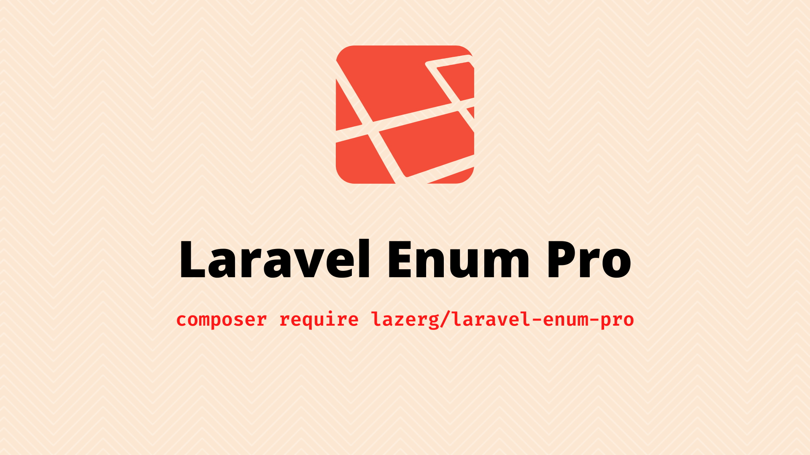

# Laravel Enum Pro



[](https://packagist.org/packages/lazerg/laravel-enum-pro)
[](https://packagist.org/packages/lazerg/laravel-enum-pro)
[](https://packagist.org/packages/lazerg/laravel-enum-pro)
[](https://packagist.org/packages/lazerg/laravel-enum-pro)
[](https://packagist.org/packages/lazerg/laravel-enum-pro)

`Laravel Enum Pro` is a powerful trait that supercharges PHP 8.1+ enums with Laravel-friendly utilities. Get values, names, random cases, and form-ready options with a clean, fluent API.

## Features

- Works directly with native PHP enums
- Access case values via static method calls
- Retrieve enum names and values as collections, arrays or strings
- Generate random values for testing and factories
- Build option and selection lists for form inputs

## Installation

```bash
composer require lazerg/laravel-enum-pro
```

## Basic Usage

Create an enum and include the trait:

```php
enum LevelTypes: int
{
    use \Lazerg\LaravelEnumPro\EnumPro;

    case VERY_EASY = 1;
    case EASY = 2;
    case MEDIUM = 3;
    case STRONG = 4;
    case VERY_STRONG = 5;
}
```

### Accessing Values

```php
LevelTypes::VERY_EASY();          // 1
LevelTypes::valueOf('VERY_EASY'); // 1

$enum = LevelTypes::MEDIUM;
$enum();                          // 3 (invoke to get value)
```

### Working With Names

```php
LevelTypes::names();         // Collection: ['VERY_EASY', 'EASY', 'MEDIUM', 'STRONG', 'VERY_STRONG']
LevelTypes::namesToArray();  // ['VERY_EASY', 'EASY', 'MEDIUM', 'STRONG', 'VERY_STRONG']
LevelTypes::namesToString(); // "VERY_EASY, EASY, MEDIUM, STRONG, VERY_STRONG"
LevelTypes::nameOf(1);       // 'VERY_EASY'
```

### Working With Values

```php
LevelTypes::values();         // Collection: [1, 2, 3, 4, 5]
LevelTypes::valuesToArray();  // [1, 2, 3, 4, 5]
LevelTypes::valuesToString(); // "1,2,3,4,5"
```

### Randomization

```php
LevelTypes::random();         // Random enum case (e.g., LevelTypes::MEDIUM)
LevelTypes::randomFirst();    // Alias for random()
LevelTypes::randomArray(3);   // Array of 3 random enum cases
```

### Options and Selections

Use these helpers when building form inputs.

```php
LevelTypes::options();            // Collection of ['id' => value, 'name' => name]
LevelTypes::optionsToArray();     // Same as above, as array
LevelTypes::getOption(1);         // Single option: ['id' => 1, 'name' => 'VERY_EASY']
LevelTypes::getOptions([1, 3]);   // Collection of options for values 1 and 3

LevelTypes::selections();         // Collection of ['value' => value, 'label' => name]
LevelTypes::selectionsToArray();  // Same as above, as array
```

Example output of `options()`:

```php
Illuminate\Support\Collection {
    #items: [
        ['id' => 1, 'name' => 'VERY_EASY'],
        ['id' => 2, 'name' => 'EASY'],
        ['id' => 3, 'name' => 'MEDIUM'],
        ['id' => 4, 'name' => 'STRONG'],
        ['id' => 5, 'name' => 'VERY_STRONG'],
    ]
}
```

Example output of `selections()`:

```php
Illuminate\Support\Collection {
    #items: [
        ['value' => 1, 'label' => 'VERY_EASY'],
        ['value' => 2, 'label' => 'EASY'],
        ['value' => 3, 'label' => 'MEDIUM'],
        ['value' => 4, 'label' => 'STRONG'],
        ['value' => 5, 'label' => 'VERY_STRONG'],
    ]
}
```

## Testing

Run the test suite with [Pest](https://pestphp.com/):

```bash
./vendor/bin/pest
```

## License

This package is open-sourced software licensed under the [MIT license](LICENSE) as specified in `composer.json`.
